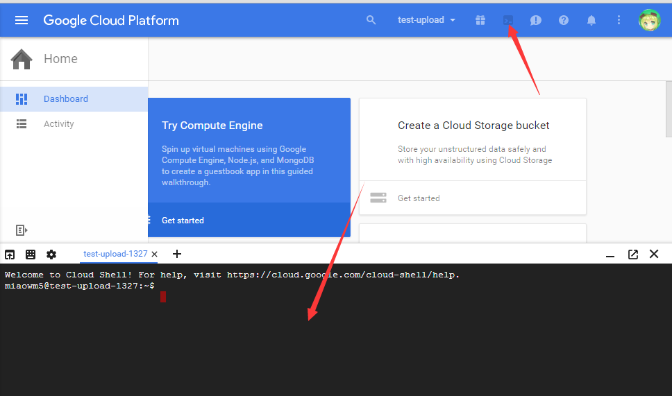
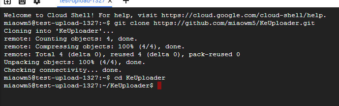
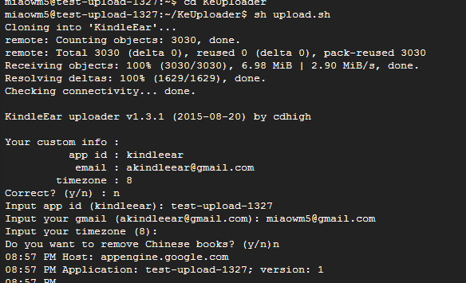

# KeUploader

## Upload KindleEar in 4 Steps

__1.Open cloud shell__



__2.Clone and cd then sh upload.sh__


```shell
git clone https://github.com/miaowm5/KeUploader.git
cd KeUploader
sh upload.sh
```



__3.Set information of your app__



__4.Open yourappid.appspot.com and enjoy. :-)__


